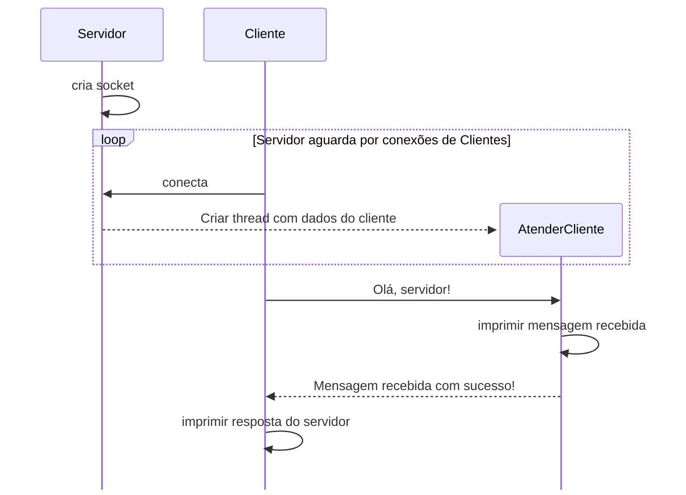
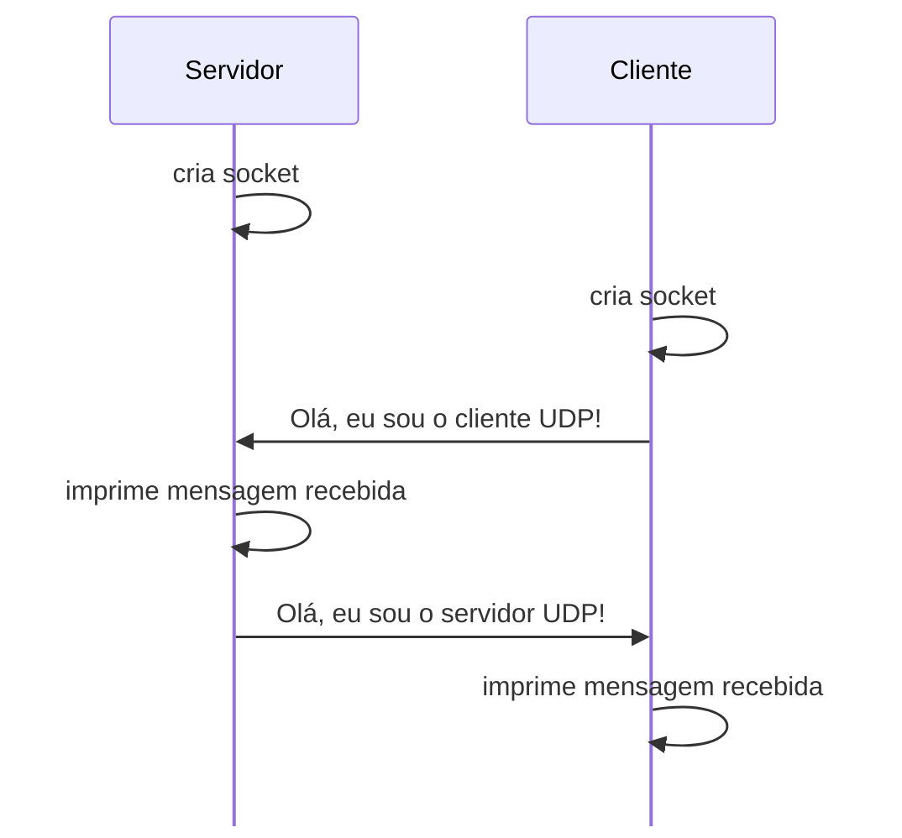
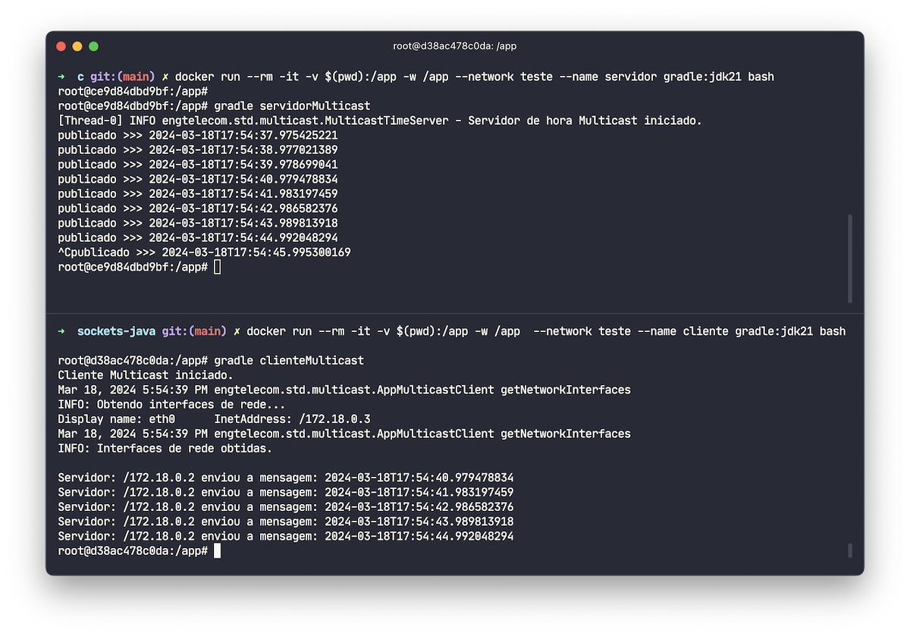

[](LICENSE)
[](https://github.com/std29006/sockets-java/actions/workflows/gradle.yml)

# Exemplos de sockets TCP e UDP com a API Java I/O

> ## Aviso de isenção de responsabilidade
> 
> Para os códigos aqui disponibilizados optou-se por uma organização simplificada para facilitar a leitura e entendimento. Contudo, o código aqui apresentado tem grande potencial de melhorias para torná-lo adequado para atender situações reais ou mesmo, para atender demandas das listas de exercícios e projetos desenvolvidos dentro da disciplina.

Java possui diferentes APIs para lidar com operações de I/O:. Aqui é apresentado um exemplo com a API Java I/O, que segue modelo bloqueante.

A API Java NIO.2 permite desenvolver aplicações com comunicação assíncrona, porém seu entendimento demanda mais tempo. Veja mais detalhes na [documentação oficial da Oracle](https://docs.oracle.com/javase/8/docs/technotes/guides/io/index.html). 

No arquivo [build.gradle](app/build.gradle) foram criadas tarefas para permitir executar servidor e o cliente (TCP e UDP) diretamente com o [gradle](https://www.gradle.org). Abaixo são apresentados os comandos para execução dos exemplos.


## Sockets TCP

O servidor cria uma *Thread* para atender cada cliente e essa Thread é destruída após isso.



1. `Servidor` cria socket TCP e aguarda por conexões
1. `Cliente` conecta no servidor
1. `Servidor` cria uma Thread (`AtenderCliente`) para atender o `Cliente`
1. `Cliente` envia mensagem de saudação
1. `AtenderCliente` imprime a mensagem recebida no console
1. `AtenderCliente` envia resposta ao `Cliente`
1. `Cliente` imprime a mensagem recebida no console
1. `AtenderCliente` é encerrada
1. `Cliente` é encerrado


### Como executar o servidor TCP

Abra um terminal e execute uma das linhas abaixo de acordo com o sistema operacional do computador que esteja usando.

```bash
# No Linux ou macOS
./gradlew -q servidorTcp

# No Windows
gradle.bat -q servidorTcp
```

### Como executar o cliente TCP

Abra um outro terminal e execute uma das linhas abaixo.

```bash
# Tentará conectar na porta 12345 na localhost
./gradlew -q clienteTcp

# Passando o IP e porta do servidor como argumentos de linha de comando
./gradlew -q clienteTcp --args "localhost 12345"
```

## Sockets UDP



1. Servidor cria socket UDP
2. Cliente cria socket UDP
3. Servidor aguarda por datagrama
4. Cliente envia datagrama
5. Cliente aguarda por datagrama
6. Servidor imprime no console
7. Servidor envia datagrama
8. Cliente imprime no console

### Como executar o servidor TCP

Abra um terminal e execute a linha abaixo.

```bash
./gradlew -q servidorUdp
```

### Como executar o cliente TCP

Abra um outro terminal e execute uma das linhas abaixo.


```bash
# Tentará conectar na porta 9876 na localhost
./gradlew -q clienteUdp

# Passando o IP e porta do servidor como argumentos de linha de comando
./gradlew -q clienteUdp --args "localhost 9876"
```

## Comunicação Multicast

Neste exemplo, o servidor envia periodicamente uma mensagem com sua hora local para um grupo de clientes que estão escutando em um endereço multicast.

O cliente, para todas interfaces de rede, escuta em um endereço multicast e imprime no console a mensagem recebida do servidor.



### Como executar o servidor Multicast

Abra um terminal e execute a linha abaixo.

```bash
./gradlew -q servidorMulticast
```

### Como executar o cliente Multicast

Abra um outro terminal e execute a linha abaixo.

```bash
./gradlew -q clienteMulticast
```

Para encerrar a execução do servidor ou do cliente, pressione `Ctrl+C` no terminal onde o programa está sendo executado.

Para ambos os casos, o endereço multicast utilizado é `231.0.0.0` e a porta `8888`. É possível passar outros valores como argumentos de linha de comando.

```bash 
./gradlew -q servidorMulticast --args "231.0.0.1 8889"
./gradlew -q clienteMulticast  --args "231.0.0.1 8889"
```


### Referências

- https://en.wikipedia.org/wiki/Multicast_address
- https://www.iana.org/assignments/multicast-addresses/multicast-addresses.xhtml
- https://github.com/jppf-grid/JPPF/blob/master/common/src/java/org/jppf/comm/discovery/JPPFBroadcaster.java
- https://github.com/jppf-grid/JPPF/blob/master/client/src/java/org/jppf/client/JPPFMulticastReceiverThread.java
- https://github.com/jppf-grid/JPPF/blob/master/common/src/java/org/jppf/comm/discovery/JPPFMulticastReceiver.java